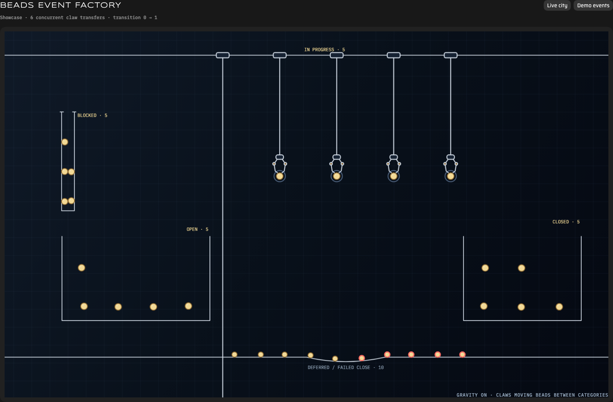

# Beads Event Factory

Wesley Davidson's Beads Event Factory visualizer, extracted from the Gas City blog demo and extended into a live, read-only Beads viewer.



The screenshot shows the synthetic Showcase mode. Run the viewer and open `http://127.0.0.1:4173/?showcase=1` to try it.

The canvas, factory machinery, bins, claws, physics, visual design, and twelve-event journal playback are the original visualizer. The standalone viewer adds live city data, filters, hover summaries, and click details without replacing that design.

## Provenance

The factory and its visual design were created by Wesley Davidson. Chris Sells adapted it to run inside the Gas City website. `public/index.html` is based on the decoded inner document from that website integration:

```text
gascity/landing-page
sites/blog.gascity.com/public/demos/beads-event-factory.html
website integration commit 84c59bc (Chris Sells, 2026-08-26)
```

The blog wrapper sandboxes that document in an iframe. The standalone repository serves the inner document directly so it can call the local read-only API facade.

## Live viewer

When a Gas City supervisor is available, the factory starts in live mode and:

- discovers running cities;
- discovers the HQ and initialized rig stores and keeps an independent event cursor for each one;
- primes the cursors, loads one state snapshot, then consumes `bd events tail` records for live changes;
- places real beads in the original blocked funnel, open bin, work area, closed bin, and deferred/failed floor;
- animates journaled status changes with concurrent claws instead of teleporting beads between categories;
- reconciles with a state snapshot every 30 seconds because pulls and merges are not journaled;
- polls every 15 seconds while preserving already-rendered beads and their motion;
- gives newly discovered beads a slight random spawn offset before gravity takes over;
- gives every in-progress bead its own work claw;
- uses Gas City's real agent activity to bob the assigned claw, pulse the active bead, and show a speech bubble when output changes;
- filters by type or text and can include the newest closed records;
- shows ID, title, type, priority, status, and assignee on hover;
- shows the full record, description, labels, relationships, children, and metadata on click.

The **Demo events** button returns to the original twelve-event animation. **Live city** switches back to current data.

The **Showcase** button runs an explicitly synthetic, continuously changing category exercise with open, in-progress, blocked, deferred, closed, and failed-close beads. Status changes use concurrent claws to pick up each changing bead and release it into its new category; they do not teleport through the bins. It never labels those examples as city data. Add `showcase=1` to open directly in this mode.

## Run

Requirements:

- Node.js 20 or newer.
- Gas City 1.4.1 or newer with its supervisor API running.
- A Beads build with `bd events`, with the event journal enabled in every store you want to watch.

```sh
gc status
bd config set events-journal true
npm start -- --city my-city
```

Run the config command from each rig as well as the city HQ. If the journal is disabled or the selected `bd` lacks event support, the viewer says so and falls back to periodic snapshots; it does not label snapshot polling as journal activity.

To test a release-candidate binary without replacing the installed `bd`:

```sh
npm start -- --city my-city --bd /absolute/path/to/bd
```

Open <http://127.0.0.1:4173>.

For a faster temporary polling interval, pass milliseconds in the viewer URL. The value is clamped between 500 ms and 60 seconds; the default remains 15 seconds:

```text
http://127.0.0.1:4173/?city=my-city&poll=1000
http://127.0.0.1:4173/?city=my-city&poll=1000&closed=1
http://127.0.0.1:4173/?city=my-city&poll=1000&closed=1&search=my-label
http://127.0.0.1:4173/?city=my-city&showcase=1
```

The defaults are:

- viewer: `http://127.0.0.1:4173`
- Gas City supervisor API: `http://127.0.0.1:8372`

Override them when necessary:

```sh
npm start -- --city my-city --api http://127.0.0.1:8372 --port 4173
```

The viewer binds to loopback unless `--host` is explicitly supplied.

## Read-only boundary

The local server exposes only:

- `GET /api/config`
- `GET /api/cities`
- `GET /api/agents`
- `GET /api/events`
- `GET /api/beads`
- `GET /api/bead/:id`
- `GET /api/bead/:id/deps`
- `GET /api/bead/:id/graph`

Unknown API routes return `404`; non-read methods return `405`.

## Verify

```sh
npm run verify
npm run test:live -- --city my-city
```

`verify` runs syntax checks, the normal test suite, and the stress harness. The stress harness drives 121 synthetic beads through rapid refreshes, status changes, additions and removals, multiple work claws, filtering, details, resizing, API failure, and recovery. It also asserts that unchanged beads and claws retain object identity across refreshes. The separate live smoke command requires a running Gas City.
